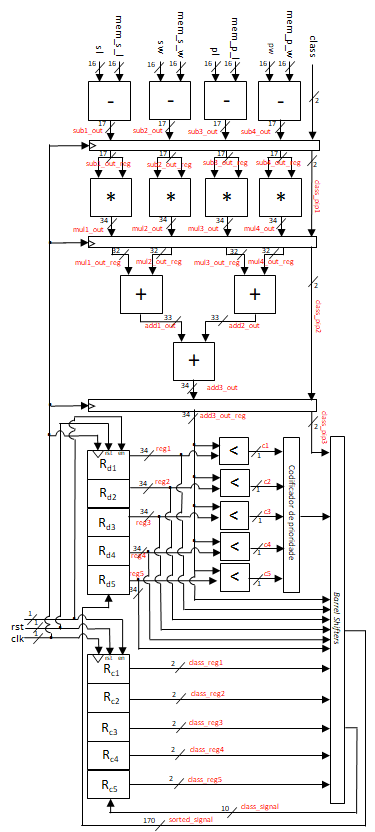
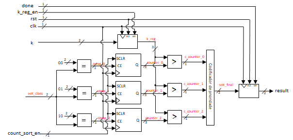
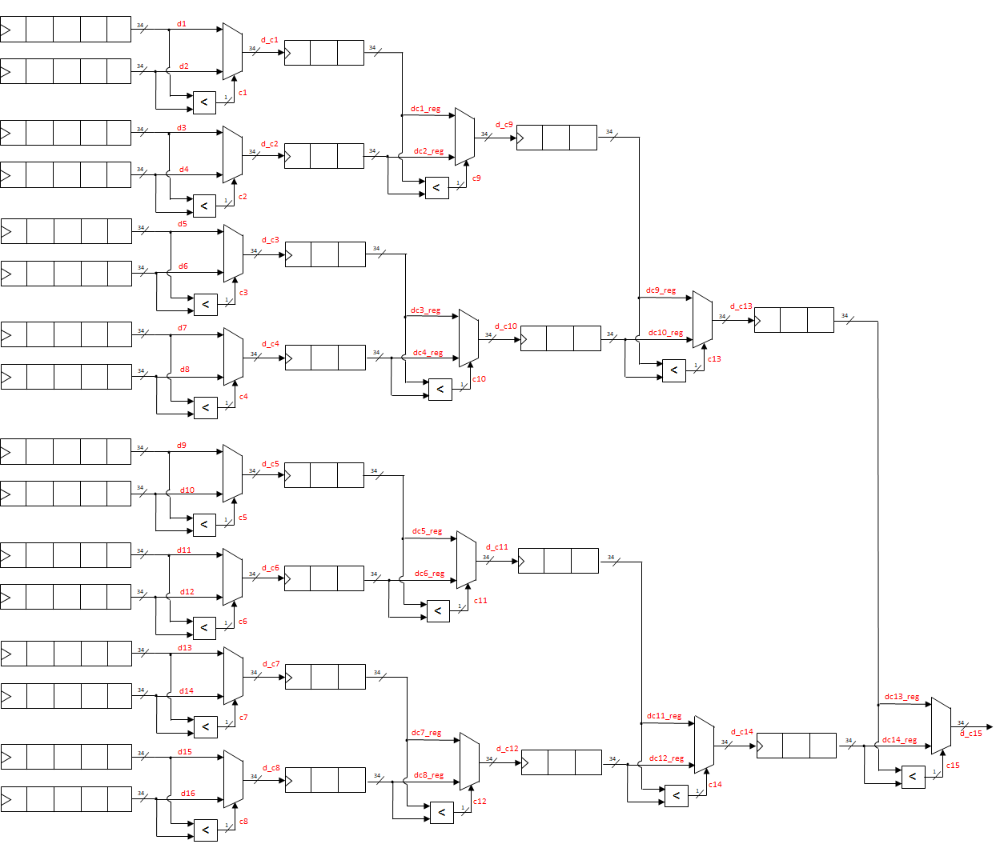
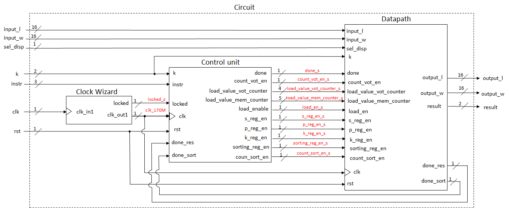
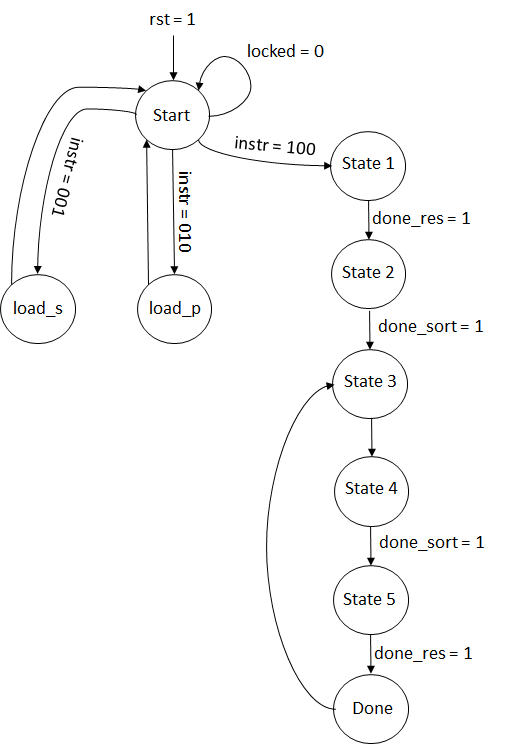
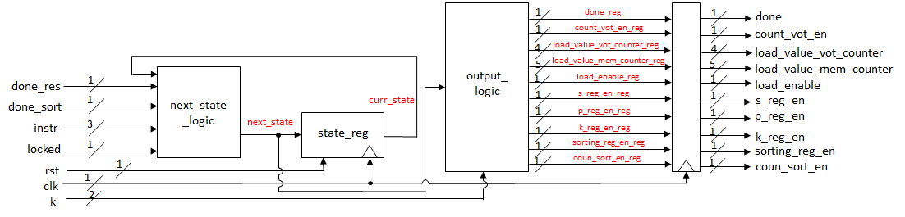
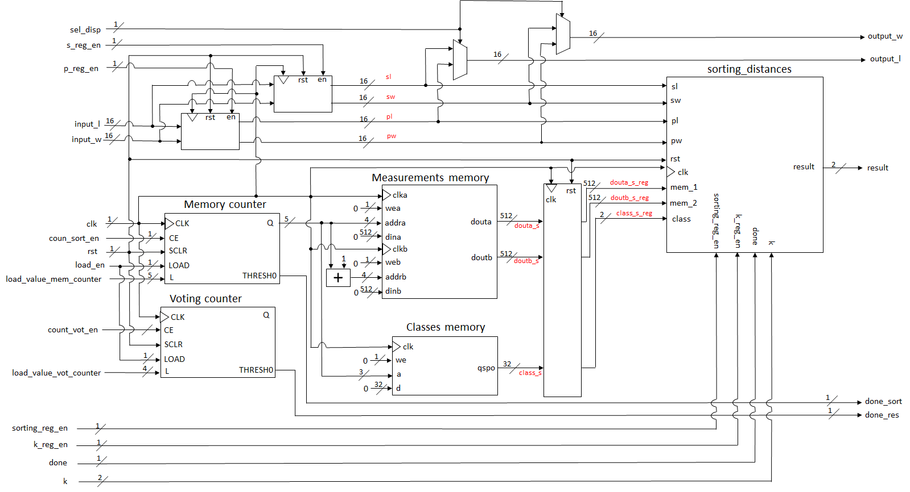
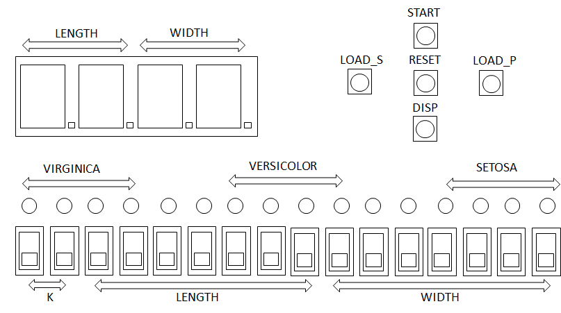
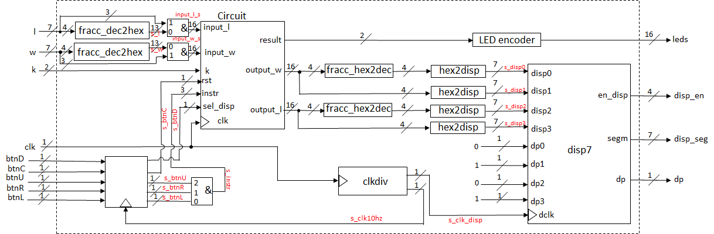

# k-Nearest Neighbors(KNN) Iris flower classification algorithm in VHDL

This project was developed for the Digital System Design course. It consists on classifying Iris flowers from the [Iris dataset](https://archive.ics.uci.edu/ml/datasets/Iris) based on 4 measurements (in cm): sepal length, sepal width, petal length and petal width to one of three possible classes (setosa, versicolor or virginica) whose design was proposed [here](https://kevinzakka.github.io/2016/07/13/k-nearest-neighbor/). The algorithm was implemented in hardware on the Basys3 FPGA in VHDL.

The measurements are real numbers represented in unsigned fixed-point format Q3.13 and the attributes are represented as 2-bit integers (00 – setosa, 01 – versicolor, 10 – virginica). The distance metric for the KNN algorithm is the square of the Euclidean distance and the system can be configure to produce results for k = 1, 3 or 5. The main goals of this project is to achieve the highest performance possible given the target device and technology.

# Algorithm

The algorithm can be summarized into two steps:

1) For each instance of the training dataset, calculate the distance between the new instance (the one we are trying to classify) and the respective training instance, inserting the result into a list of size k in ascending order.

2) Determine the most common class (flower species) from the k-sized list obtained at the end of the first step.

# Implementation of the algorithm in hardware

For the first step, the calculation of the square of the Euclidean distance is made using 4 subtractors, 4 multipliers and 3 adders in a design with 3 pipelined stages in order to reduce the circuit's critical path. After obtaining the new distance, there are 5 comparators to compare this value with the 5 values from the ascending sorted list. The result of the comparators goes to a priority encoder, which determines if the new distance is going to the list (i.e. if the value is lower than at least one value of the sorted list) and how many right shifts is necessary in order to insert the new distance into the list. It is important to highlight that, in order to keep the coherency between the new distance and its respective class, there is another list for the classes which suffers the same right shifts as the distance list.



For the second step, after obtaining the sorted list (of the classes), each class is compared with one of the three possible values (00, 01 or 10) by using three comparators, where each one is associated to a counter. Afterwards, the value of each counter is compared with the value of k (i.e. another 3 comparators are used), following this logic:

- For k = 00 (corresponds to k = 1), the most common class is the one with value 1, which corresponds to checking which counter is more than 0.

- For k = 01 (corresponds to k = 3), the most common class is the one with value 2 or 3, which corresponds to checking which counter is more than 1.

- For k = 10 (corresponds to k = 5), the most common class is the one with value 3, 4 or 5, which corresponds to checking which counter is more than 2.

The output of the comparators is connected to a priority encoder which finds which was the most common class.



**NOTE: The code for this two steps can be found inside the src/ folder in the sorting.vhd file.**

## Parallelism

The training dataset is composed by 108 instances, hence, if we only use one instance of the circuit of the first step, it takes 108 clock cycles (plus the 3 cycles overhead from the pipelining) to obtain the sorted list. One way to optimize the performance is to use several instances of that circuit, obtaining several sorted lists, which then are compared in a binary tree structure between each other until reaching the final sorted list. This parallelized structure is composed by 16 first step circuit instance and 15 comparators:



To divide the training dataset equally, 4 "fake" instances were added (with null measurements and class "11"), as 112/16=7. Now, obtaining the final sorted list takes 7 clock cycles (plus the 3 clock cycles overhead from the pipelining) instead of 108. It is important to highlight that, as at tops we need the 5 lowest distances (if k = 5), the sorted intermediate lists only need to store 3 values each, which allows to save 6 distances in pairs.

Due to the 3 registers in the intermediate lists, obtaining the first lowest distance takes 3 clock cycles but the following ones are obtained in consecutive clock cycles. Another advantage is that, as soon as we get one of the lowest distances, the counters of the second step circuit are working simultaneously which means that the most common class is calculated one clock cycle after obtaing the last lowest distance (depending on the value of k).

**NOTE: The code for this two steps can be found inside the src/ folder in the sorting_distances.vhd file.**

## Performance

After applying the parallelism, the first step takes 10 clock cycles and the second step takes 3 + k clock cycles, hence, overall, the algorithm takes between 14 (10 + 3 + 1) to 18 (10 + 3 + 5) clock cycles to classify a new instance flower.

## Global design

The global design is based on a FSMD (Finite state machine with datapath) architecture where the control unit and the datapath work at a frequency of 170 MHz (clock wizard converts from 100 MHz to 170 MHz).



**NOTE: The code of the global design can be found in the circuit.vhd file inside the src/ folder.**

# Control unit

The state diagram of the control unit consists of the following states (besides the start and done states):

- **load_s:** user loads sepal length and width.

- **load_p:** user loads petal length and width.

- **State 1:** init memory counter (for reading data from the training dataset). Takes 4 clock cycles (the voting counter was used for this) due to 3 pipeline stages and register on the memory output.

- **State 2:** sorting of the lists (takes 7 clock cycles).

- **State 3:** reset of both counters (memory and voting). Takes 1 clock cycle.

- **State 4:** init voting counter. Takes 3 clock cycles (this time, the memory counter was used for this) due to intermediate registers in the parallelized circuit.

- **State 5:** voting (obtain the most common class). Takes k + 1 clock cycles.



The block diagram of the control unit is displayed below. Note the register at the output in order to reduce the critical path (that without this register, was in the connection between the control unit and the datapath).



**NOTE: The code of the control unit can be found in the control.vhd file inside the src/ folder.**

# Datapath

The datapath is composed by the memories (measurements and classes), the counters (memory and voting), the registers to save the measurements of the flower inserted by the user and the algorithm block. The measurements memory is a 2x512 bits RAM with 14 positions and the classes memory is a 32-bit distributed memory with 7 positions. Note the register in the output of each memory (without this register, the critical path was in the connection between these memories and the algorithm block).

**NOTE 1: For initializing the memories, you must use the .coe files inside the include/ folder.**

**NOTE 2: The memory counter was configured to count 2 by 2 until reaching the value 21. The voting memory was configured to count until 18.**

**NOTE 3: The code of the datapath can be found in the datapath.vhd file inside the src/ folder.**



## FPGA interface

The FPGA was configured to use 14 switches to insert the petal or sepal length and width (depending on the button pushed) as 3 bits are used for the decimal part and 4 bits are used for the fractional part. The other two switches select the value of k. There are other push buttons for starting the algorithm (should only be pushed after inserting the flower measurements), to reset and to select which measurements (sepal or petal) are represented on the 7-segment display. Finally, the leds are used to represent the result of the classification.



The VHDL top module is displayed on the image below and is composed by: the 7-segment display interface, clock divider (for the 7-segment display), LEDs encoder, blocks to convert from hexadecimal to 7-segment and the blocks that convert the fractional part of the measurements from decimal to hexadecimal and vice-versa.



**NOTE 1: The .xdc file for associating the top module inputs/outputs with the FPGA peripherals is inside the constraints/ folder.**

**NOTE 2: The VHDL top module (fpga_basicIO.vhd) and the other modules are inside the src/ folder.**

## Results

- Regarding the consumption of the FPGA logic primitives, it is important to highlight the quantity of DSPs (71%) used.

|       Resource      |    LUT   |    FF    |   BRAM   |   DSP   |    
|:--------------------|:---------|:---------|:---------|:--------|
|   Quantity used     |   9757   |   9066   |   14,5   |   64    |
|   Total available   |   20800  |   41600  |    50    |   90    |
|     Percentage      |   46,91% |   21,79% |   29,00% |  71,11% |

- Regarding the temporal characteristics, for a 170 MHz frequency (corresponds to a period of 5.88 ns), the WNS (Worst Negative Slack) was 0.079 ns and the WHS (Worst Hold Stack) was 0,012 ns.

- Finally, taking into account the clock period (5.88 ns) and the duration of each state of the control unit, we can use this expression to determine the performance of the algorithm (processing time between reading the flower measurements until reaching its class):
```
t = 5.88 x ( 1 + 4 + 7 + 1 + 3 + k + 1)
```  

Overall, the algorithm takes between 106 ns (k = 1) and 130 ns (k = 5) to be performed.